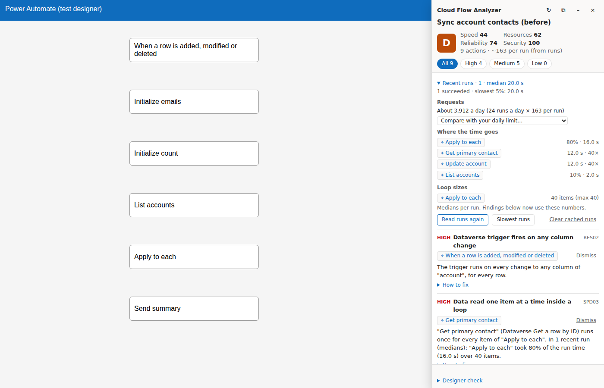
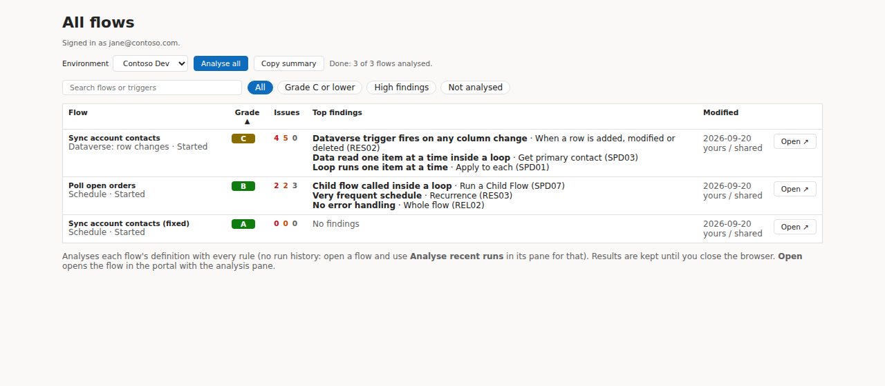

# Cloud Flow Analyzer

[](https://github.com/leduc212/cloud-flow-analyzer/actions/workflows/ci.yml)
[](https://leduc212.github.io/cloud-flow-analyzer/)

Finds slow, wasteful and fragile patterns in Power Automate cloud flows, and shows the better
pattern for each, right next to the designer.

A read-only Edge/Chrome extension: open a flow in the maker portal, click **Analyse this flow**,
and get a grade, 30 rules' worth of findings based on Microsoft's guidance, and measurements
from the flow's recent runs. No server, no app registration, nothing leaves your browser.



- **Try it without installing:** paste a flow definition on the
  [project site](https://leduc212.github.io/cloud-flow-analyzer/).
- **Every rule explained:** [rules](https://leduc212.github.io/cloud-flow-analyzer/rules.html).
- **Privacy:** [policy](https://leduc212.github.io/cloud-flow-analyzer/privacy.html) ·
  **Security:** [SECURITY.md](SECURITY.md) · **Changes:** [CHANGELOG.md](CHANGELOG.md)

## Install

1. Download `cloud-flow-analyzer-v….zip` from the latest
   [release](https://github.com/leduc212/cloud-flow-analyzer/releases) and unzip it.
2. Open `edge://extensions` (or `chrome://extensions`), turn on **Developer mode**, click
   **Load unpacked** and pick the unzipped folder.
3. Open [make.powerautomate.com](https://make.powerautomate.com) and sign in (or refresh the tab
   if it was already open) so the extension picks up your sign-in.

## Rules

| ID    | Category    | Finds                                                                        |
| ----- | ----------- | ---------------------------------------------------------------------------- |
| SPD01 | Speed       | 📊 Apply to each running one item at a time around connector calls           |
| SPD02 | Speed       | Variables written inside a loop (use Select / Filter array)                  |
| SPD03 | Speed       | 📊 Records read one at a time inside a loop (N+1 queries)                    |
| SPD04 | Speed       | Loop inside a loop                                                           |
| SPD05 | Speed       | 📊 Loop that only filters items with a Condition (filter before the loop)    |
| SPD07 | Speed       | 📊 Child flow called inside a loop                                           |
| SPD08 | Speed       | Polling with Do until and Delay                                              |
| SPD09 | Speed       | Same record or list read twice with the same inputs                          |
| SPD10 | Speed       | Loop over a query that returns one row                                       |
| RES01 | Resources   | 📊 Most runs stop at a first Condition a trigger condition could do instead  |
| RES02 | Resources   | Dataverse trigger without "Select columns"                                   |
| RES03 | Resources   | Recurrence every few minutes or seconds                                      |
| RES04 | Resources   | List query without column list, filter or row limit (worse with pagination)  |
| RES06 | Resources   | 📊 Requests a day take a large share of the daily limit you set              |
| RES07 | Resources   | Dataverse update that writes back the row's unchanged values                 |
| RES08 | Resources   | 📊 One create / update / delete per loop item (use bulk or batch requests)   |
| REL01 | Reliability | Parallel loop writing variables (race condition)                             |
| REL02 | Reliability | No error handling (Try / Catch)                                              |
| REL03 | Reliability | Retry policy set to None; 📊 calls throttled (429) or retried in recent runs |
| REL04 | Reliability | Do until with default limits                                                 |
| REL05 | Reliability | Close to the 500-action or 8-level nesting limits                            |
| REL06 | Reliability | 📊 Runs wait to start (trigger concurrency limit, or throttling)             |
| REL07 | Reliability | Flow updates the table or list that triggers it (infinite loop)              |
| REL08 | Reliability | Error path that never ends the run as Failed (failures show as Succeeded)    |
| REL09 | Reliability | First item of a query read with `[0]` without checking the list is not empty |
| REL10 | Reliability | List query that silently stops at its default page (100 / 256 / 5,000 rows)  |
| SEC01 | Security    | Key Vault secret shown in run history (Secure inputs / outputs off)          |
| SEC02 | Security    | Password, API key or signature typed into an HTTP action                     |
| SEC03 | Security    | HTTP trigger that anyone with the URL can call                               |
| MNT02 | Maintenance | Three or more steps with default names (`Compose 3`); not in the grade       |

📊 = uses measured numbers when you analyse recent runs (see step 7 below).

Each finding explains why it matters, how to fix it, and shows the better pattern.

**Grade.** Each category starts at 100 and loses points per finding (high 25, medium 10, low 3,
times the rule's confidence). The overall score weighs speed 35%, resources 25%, reliability 25%
and security 15%; A ≥ 90, B ≥ 80, C ≥ 65, D ≥ 50. While a high-severity security finding is
open, the grade can't be better than C.

## Using it

1. Install the extension (above).
2. Open a flow in [make.powerautomate.com](https://make.powerautomate.com): its details page or
   the designer.
3. Click the extension icon, then **Analyse this flow**. A pane opens on the right with the
   grade and the findings.
4. Click an action name in a finding (⌖) to jump to it in the designer, even when it's far
   down the flow. Collapsed scopes, loops, Condition branches and Switch cases on the way are
   opened for you (only ones that are collapsed; nothing else in the designer is touched).
5. **Dismiss** findings you've decided to keep (remembered per flow in your browser and left out
   of the score), and **⧉ Copy report** to paste the findings as Markdown into a ticket or chat.
6. **How to fix** under each finding explains the better pattern, with a before/after and a link
   to the Microsoft docs.
7. **Analyse recent runs** reads the flow's last 20 finished runs (**Slowest runs**: the 20
   slowest of the last 100): how long they took, where the time goes, how many items each loop
   handled, which actions failed, were retried or throttled, and how many requests the flow
   makes a day. Pick your licence's daily request limit (6,000 / 40,000 / 250,000, or your own)
   to see the flow's share of it. Findings marked 📊 in the rules table then use the measured
   numbers (a loop taking 80% of the run weighs more than one taking 2%). **Stop** keeps the runs
   read so far. Only timings, statuses and error codes are read, never the data inside the runs.
   They are kept in your browser so the same run isn't read twice (**Clear cached runs** removes
   them).

**All flows in an environment:** click the extension icon, then **All flows in this environment**.
The page lists every flow you can see (all of them for environment admins). **Analyse all** grades
each one with the definition rules; sort by grade or issues, filter to the ones that need work,
**Copy summary** as a Markdown table, and **Open** a flow in the portal with its analysis pane.
Results are kept until you close the browser, and an edited flow is analysed again.

If clicking an action doesn't move the designer, open **Designer check** at the bottom of the
pane, copy it and send it to us.



## Capture tool

For troubleshooting and for building new rules: the capture tool (extension icon → **Open
capture tool**) collects API responses for chosen flows, runs the rules on them and downloads
everything as one anonymised file. See [docs/CAPTURE.md](docs/CAPTURE.md).

## What's here

| Path                 | What it is                                                                    |
| -------------------- | ----------------------------------------------------------------------------- |
| `packages/core`      | Flow parser, rules, scoring and anonymiser (pure TypeScript, no browser code) |
| `apps/extension`     | Manifest V3 extension: popup, analysis pane, All flows page, capture tool     |
| `apps/web`           | Project site: paste-a-flow demo, rule docs, privacy policy (GitHub Pages)     |
| `fixtures/flows`     | Sample flows used by the tests (a "before" and "after" flow, a solution flow) |
| `scripts/analyse.ts` | Analyse a flow file or a capture file from the command line                   |
| `docs/PLAN.md`       | Goals, rule catalogue, architecture, milestones                               |
| `docs/STORE.md`      | Store listing text and permission justifications                              |

## Development

Needs Node 22 and pnpm 10.

```sh
pnpm install
pnpm check            # lint, format check, typecheck, tests, build
pnpm test             # unit tests
pnpm build && pnpm test:e2e   # browser tests: the built extension in Chromium
pnpm --filter @cfa/extension dev    # rebuild the extension on change
pnpm analyse fixtures/flows/sync-contacts-bad.json   # analyse a flow or capture file
pnpm --filter @cfa/web dev          # the project site
SCREENSHOTS=1 pnpm test:e2e screenshots   # refresh docs/images
```

Releases: bump the version in `apps/extension/public/manifest.json`, add a `CHANGELOG.md`
section, and push a `v<version>` tag; the Release workflow publishes the zip. The site deploys
from `main` (Settings → Pages → Source: GitHub Actions). Store listing text:
[docs/STORE.md](docs/STORE.md).

## Licence

[MIT](LICENSE)
